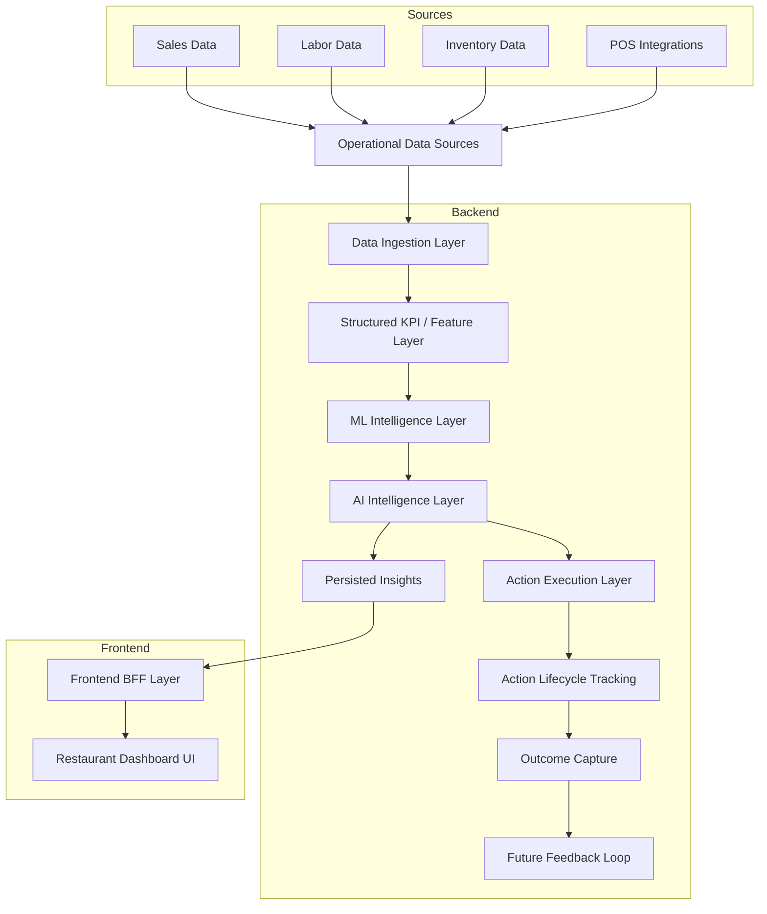
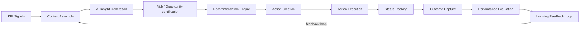

# Valora AI

Valora AI is a decision intelligence platform designed to help operators monitor performance, detect risks, generate AI-driven insights, and convert recommendations into trackable actions.

The current implementation focuses on restaurant operations, with an architecture designed to expand into other industries.

---

## Core Capabilities

- KPI and operational dashboarding  
- AI-generated insights and narratives  
- Alerting and control tower monitoring  
- Action creation and lifecycle tracking  
- Multi-tenant SaaS-ready architecture  

---

## Architecture Overview

Valora AI is designed as a multi-layer intelligence system:

### 1. Data + ML Layer
This layer processes raw operational data into structured intelligence.

Examples:
- sales, labor, inventory ingestion  
- KPI computation  
- control tower metrics  
- risk detection and scoring  
- forecast generation  

---

### 2. AI Intelligence Layer
This layer converts structured data into explainable insights.

Examples:
- context assembly  
- LLM-based insight generation  
- narrative explanation of KPIs  
- recommendation generation  
- persisted AI insights  

---

### 3. Action Execution Layer
This layer turns AI recommendations into trackable operational actions.

Examples:
- action creation from insights  
- lifecycle tracking (open → acknowledged → in_progress → completed)  
- execution logging  
- outcome capture (ROI, effectiveness)  
- audit trail for decision-making  

---

## System Flow
```text
Data → KPIs → ML Signals → AI Insight → Action → Outcome
```
---

## Repository Structure
```text
valorarestaurant/
├── backend/      # FastAPI backend, AI engine, APIs
├── frontend/     # Next.js frontend + API routes (BFF)
├── db/           # Database scripts / schema work
├── docs/         # Sample data, diagrams, notes
```
---

## Backend Directory
```text
backend/
├── ValoraEngine/         # AI orchestration, context assembly, persistence
├── app/api/              # FastAPI route modules
├── app/services/         # ingestion and service logic
├── main.py               # FastAPI app entrypoint
├── requirements.txt
```
---
## Frontend Setup

The frontend is built with **Next.js (App Router)** and acts as both:
- the main user interface
- a BFF layer through `frontend/app/api/*` routes

### Frontend Directory

```text
frontend/
├── app/
│   ├── api/              # BFF routes
│   ├── restaurant/       # dashboard pages
│   ├── auth/             # auth-related pages
├── components/           # reusable UI components
├── lib/                  # helper utilities
├── package.json
├── next.config.js
```
---

## Running the Full System

### Step 1 — Setup Backend (first time only)

```bash
cd backend
python -m venv .venv
source .venv/bin/activate
pip install -r requirements.txt
```

### Step 2 — Start Backend
```bash
cd backend
source .venv/bin/activate
uvicorn main:app --reload --port 8000
```

### Step 3 — Setup Frontend (first time only)
```bash
cd frontend
npm install
```

### Step 4 — Start Frontend
```bash
cd frontend
npm run dev
```

### Step 5 — Open Application
```text
http://localhost:3000
```
---

## High-Level System Architecture



---

## AI Insight to Action Loop

